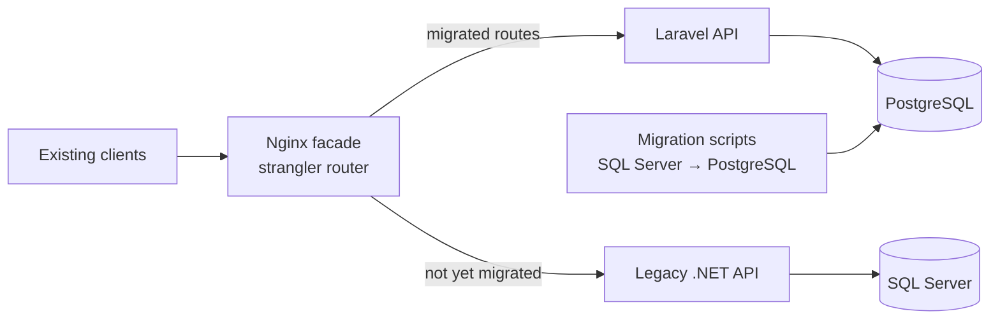

# #3 Legacy Modernization Case Study — Plan

**Pitch:** Migrating a legacy .NET + SQL Server order API to Laravel + PostgreSQL one piece at a time, with no downtime and no breaking changes for existing clients.

> Rebuild from scratch with fake data. **Never copy company code.** This repo tells the *approach*, not your employer's system.

**Status (2026-10-02):** built and verified locally. Migration 0 mismatches, parity 216/216, contract 24/24 on legacy, Laravel and the facade, 35 Pest + 18 migrator tests. Remaining: run Docker and CI on GitHub, reverse-sync tool, GIF, `git init` + push.

**Stack:** "Legacy" ASP.NET Web API + SQL Server (deliberately old-style) → Laravel (current) + PostgreSQL · Filament admin · Sanctum · Scribe · Pest · Nginx as routing facade · Docker

## Architecture (target)

## Steps

### 1. Build the "legacy" system (week 1)
- [ ] Small .NET API: customers, orders, invoices. Include typical legacy traits: fat controllers, stored procedures, inconsistent naming
- [ ] SQL Server schema + fake seed data

### 2. Contract tests first (week 1)
- [ ] Write API contract tests (e.g. Pest or Postman/Newman) against the **legacy** API. The new system must pass the same tests
- [ ] This is the key senior move: prove responses stay identical

### 3. Laravel rebuild (weeks 2–3)
- [ ] Laravel API with Sanctum; same routes and JSON shape as legacy
- [ ] Clean design: Form Requests, API Resources, service classes, Pest tests
- [ ] Filament admin panel for orders/customers
- [ ] Scribe API docs

### 4. Strangler migration (week 3)
- [ ] Nginx routes endpoints one by one from old → new (config-driven)
- [ ] Data migration script SQL Server → PostgreSQL (type mapping, identity → sequences, collation, dates), with row-count + checksum verification
- [ ] Rollback: flip a route back to legacy in one config change. Document it

### 5. Write-up (the real deliverable)
- [ ] `docs/case-study.md`: before/after, migration phases, risks, rollback plan, lessons learned
- [ ] ADRs: `0001-strangler-fig.md`, `0002-contract-tests-as-safety-net.md`, `0003-sqlserver-to-postgres-type-mapping.md`, `0004-why-laravel.md`
- [ ] Bonus (the "same API in .NET and Laravel" idea): a comparison table covering code size, performance and developer experience
