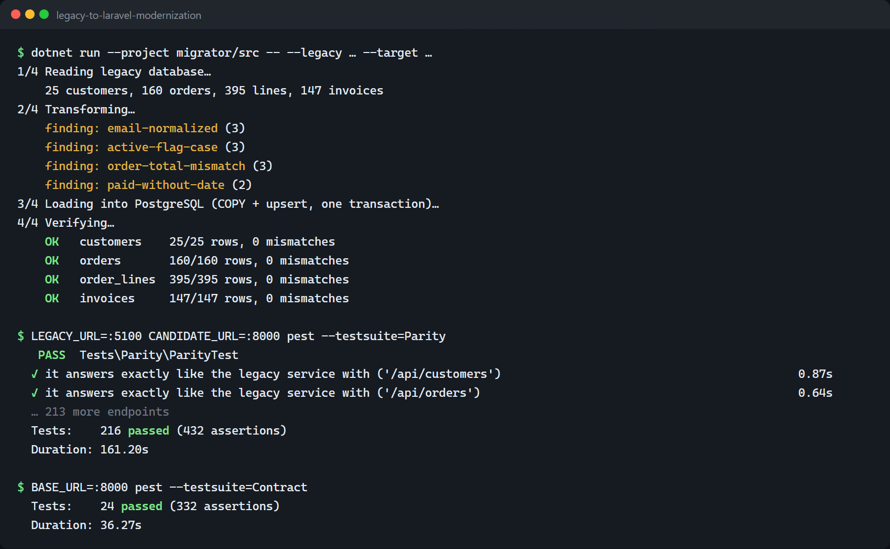
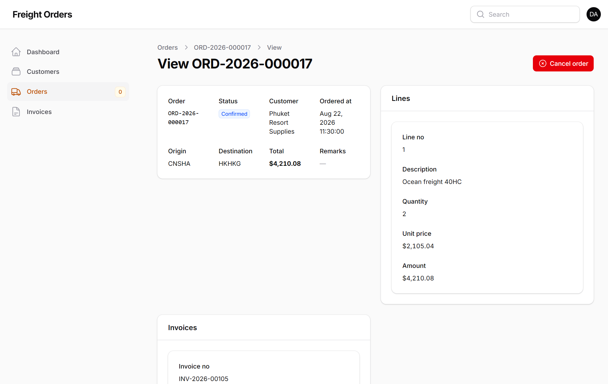
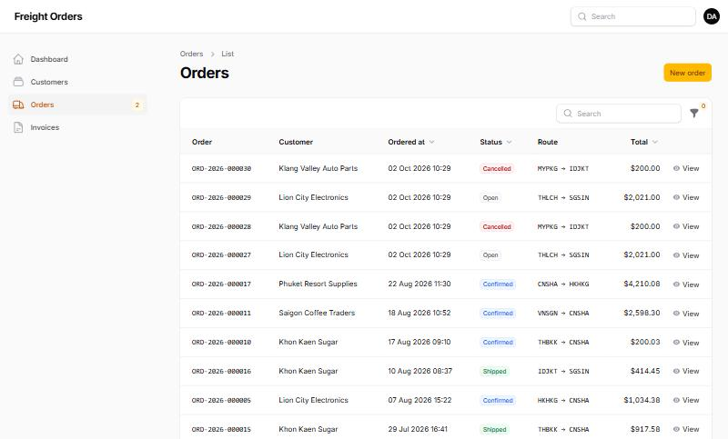
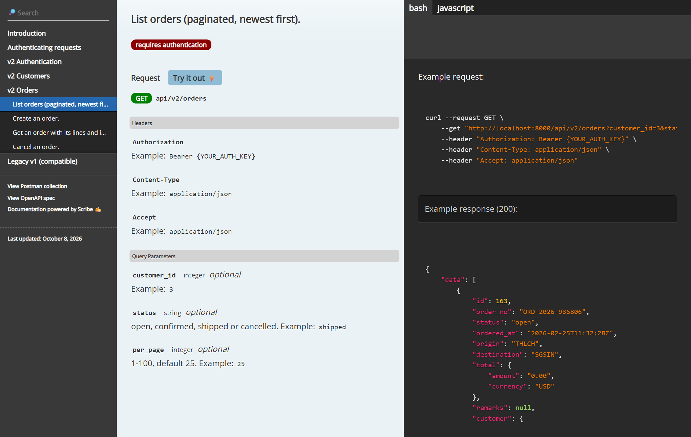
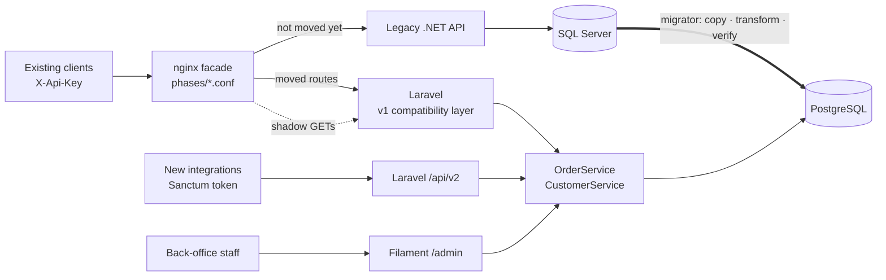
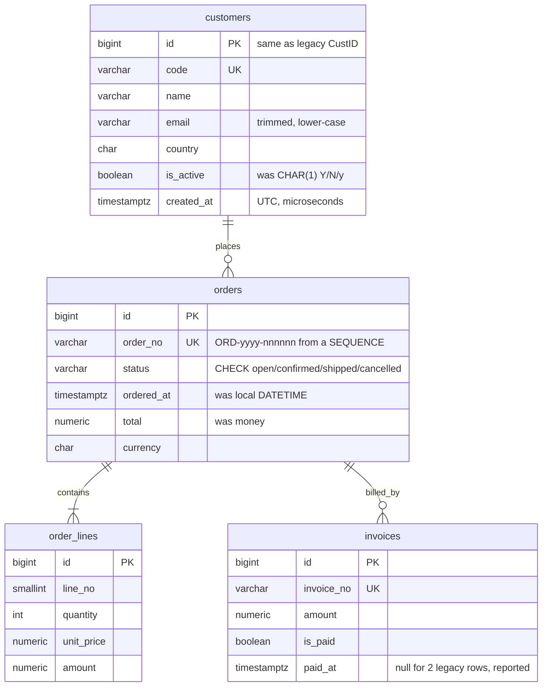

# Legacy → Laravel Modernization: a strangler-fig case study

> A legacy .NET + SQL Server order API, moved step by step to **Laravel 13 + PostgreSQL** behind an nginx facade, **without changing a single client**. Every step is reversible, and every row and response is verified.

[](https://github.com/arkarlin528/legacy-to-laravel-modernization/actions/workflows/ci.yml)


**📖 Read first: [the case study](docs/case-study.md)** (phases, data decisions, risks, and the bugs the safety nets caught)

| Proof | Result |
|---|---|
| Data migration, verified row by row | **25 customers · 160 orders · 395 lines · 147 invoices, 0 mismatches** ([report](docs/migration-report.md)) |
| Parity: every read endpoint, legacy vs new, strict JSON compare | **216 / 216 identical** |
| Contract suite against legacy · against Laravel · through the facade | **24 / 24 · 24 / 24 · 24 / 24** |
| Laravel feature + unit tests (Pest, real PostgreSQL) | **35 passing** |
| Migrator unit tests | **18 passing** |

## Screenshots

| Migrate, verify, prove parity (real output) | Filament back office: order detail |
|---|---|
|  |  |
| **Back office: orders list** | **API documentation (Scribe, generated from the code)** |
|  |  |

> All code and data are a fictional re-creation for this portfolio. No employer code, schema or data was used.

## What's in the repo

| Folder | What | Stack |
|---|---|---|
| [`legacy-api/`](legacy-api) | The "before": deliberately old-style service with fat controllers, ADO.NET, stored procedures, `tblCustomer`/`CustNm`, local timestamps | .NET 8 (Web API 2 conventions) · SQL Server |
| [`laravel-app/`](laravel-app) | The "after": the v1-compatible API, a new **v2** API, and a **Filament** back office | Laravel 13 · PostgreSQL · Sanctum · Filament 5 · Scribe · Pest |
| [`migrator/`](migrator) | Copies, transforms and **verifies** all data; re-runnable as a sync | .NET 8 · SqlClient · Npgsql (binary COPY) |
| [`facade/`](facade) | The strangler: nginx routes each method + path to old or new; shadow mirroring; write freeze | nginx |
| [`contract-tests/`](contract-tests) | Black-box HTTP tests written against legacy first, then run against everything | Pest · Guzzle |

## Tech stack

| Area | Before (legacy) | After (modernized) |
|---|---|---|
| Backend | .NET 8 in Web API 2 style: fat controllers, ADO.NET, stored procedures | **Laravel 13** (PHP 8.3): services, form requests, API resources, enums |
| Database | SQL Server (`tbl*`, `money`, local `DATETIME`, `CHAR(1)` flags) | **PostgreSQL 17** (`numeric`, `timestamptz`, `CHECK` constraints, a `SEQUENCE`) |
| Auth | One shared `X-Api-Key` | v1 keeps the key (compatibility); v2 uses **Sanctum** personal tokens |
| Admin UI | none | **Filament 5** back office |
| API docs | none | **Scribe**: HTML docs, OpenAPI spec, Postman collection |
| Migration | | **.NET migrator**: SqlClient → Npgsql binary `COPY`, upsert, row-by-row verify |
| Routing / cut-over | | **nginx** facade, one config file per phase, shadow mirroring |
| Tests | none | **Pest 4** (feature/unit on real PostgreSQL), black-box contract + parity suites, xUnit for the migrator |
| CI | | GitHub Actions: SQL Server + PostgreSQL services, the full migration run, gitleaks |

## Architecture



**Migration phases** (each one is a file in `facade/phases/`, and switching is a zero-downtime reload):
1. `0-legacy-only`: the facade is in place and changes nothing.
2. `1-shadow`: GETs are mirrored to Laravel.
3. `2-read-only-slice`: invoice listings move to Laravel.
4. `3a-freeze`: writes get `503` while the final sync runs.
5. `3b-cutover`: Laravel serves everything.

## API documentation: two APIs side by side

| | v1 (compatible, frozen) | v2 (new) |
|---|---|---|
| URLs | `/api/customers`, `/api/orders`… (unchanged) | `/api/v2/customers`, `/api/v2/orders`… |
| Auth | Shared static `X-Api-Key` | Personal **Sanctum** tokens (`POST /api/v2/tokens`) |
| JSON | PascalCase, legacy property order | snake_case, `data` / `links` / `meta` |
| Time | Bangkok local, no offset (as before) | UTC ISO-8601 (`2026-03-01T02:00:00Z`) |
| Status | `3` + `"StatusText": "Shipped"` | `"shipped"` |
| Money | Decimal number | String with 2 decimals + currency |
| Errors | `{"Message": …}`, `{"ModelState": …}` | Laravel standard (`message`, `errors`) |
| Lists | Everything at once | Paginated, filterable |

Interactive docs (Scribe) are at **`/docs`**, generated from the controllers' docblocks and validation rules, with an OpenAPI spec and a Postman collection (`/docs.openapi`, `/docs.postman`). Both versions call the same `OrderService`, so the business rules live in one place ([ADR-0005](docs/adr/0005-isolated-v1-compatibility-layer.md)).

## Database: before and after



The type and data decisions are in [ADR-0003](docs/adr/0003-sqlserver-to-postgres-migration.md) and the [case study](docs/case-study.md#data-migration-what-had-to-be-decided).

## Run it

### Docker (everything)
```bash
cp .env.example .env              # set passwords, LEGACY_API_KEY, APP_KEY
docker compose up --build         # legacy DB + API, PostgreSQL + Laravel, migrator, facade
curl -H "X-Api-Key: <your key>" http://localhost:8088/api/orders/17
```

To change the phase, set `PHASE=1-shadow` (or another phase) in `.env` and run `docker compose up -d facade`. The admin panel is at http://localhost:8088/admin.

### Local (what was used to build it)
```bash
# 1. Legacy: SQL Server LocalDB + .NET
sqlcmd -S "(localdb)\MSSQLLocalDB" -Q "CREATE DATABASE LegacyOrders"
for f in 01-schema.sql 02-procedures.sql 03-seed.sql; do sqlcmd -S "(localdb)\MSSQLLocalDB" -d LegacyOrders -I -i legacy-api/db/$f; done
dotnet run --project legacy-api                          # :5100

# 2. New: Laravel on PostgreSQL (configure laravel-app/.env)
cd laravel-app && composer install && php artisan migrate && php artisan db:seed && php artisan serve   # :8000

# 3. Move the data (re-run any time)
dotnet run --project migrator/src -- --legacy "<sql server conn>" --target "<postgres conn>" --report docs/migration-report.md

# 4. Facade (nginx) and phases
cd facade && ./switch-phase.sh 1-shadow                  # :8088

# 5. Prove it
cd contract-tests && composer install
LEGACY_URL=http://127.0.0.1:5100 CANDIDATE_URL=http://127.0.0.1:8000 vendor/bin/pest --testsuite=Parity
BASE_URL=http://127.0.0.1:8088 vendor/bin/pest --testsuite=Contract
```

> The contract suite creates customers and orders, so run the migrator again (step 3) before a parity check. Otherwise the two databases legitimately differ by the test rows.

## Design decisions
- [ADR-0001](docs/adr/0001-strangler-fig-via-nginx.md): strangler fig via an nginx facade, one file per phase
- [ADR-0002](docs/adr/0002-contract-tests-as-safety-net.md): contract and parity tests, written against legacy first
- [ADR-0003](docs/adr/0003-sqlserver-to-postgres-migration.md): SQL Server → PostgreSQL with a re-runnable, self-verifying migrator
- [ADR-0004](docs/adr/0004-why-laravel.md): why Laravel and PostgreSQL here (and when .NET would win)
- [ADR-0005](docs/adr/0005-isolated-v1-compatibility-layer.md): an isolated, deletable v1 compatibility layer
- [ADR-0006](docs/adr/0006-cutover-and-rollback.md): cut-over with a short write freeze, and the rollback plan

## CI
Every push runs the full migration story in GitHub Actions:
1. Start SQL Server and create the legacy database.
2. Start the legacy API.
3. Migrate the Laravel schema.
4. **Run the migrator**, which verifies every row.
5. Start Laravel.
6. **Parity check.**
7. **Contract suite** against legacy, against Laravel, and through the facade in mixed routing.

Separately, CI runs Pest and Pint, the migrator tests, the Docker builds and a gitleaks scan. See [`.github/workflows/ci.yml`](.github/workflows/ci.yml).

## Status and next steps
- [x] Legacy system, migrator, Laravel v1 + v2, Filament, facade phases, contract and parity suites, CI pipeline
- [ ] Reverse-sync tool (PostgreSQL → SQL Server) for rollback after cut-over
- [ ] Run the Docker stack and CI on GitHub (written, not yet executed: no Docker on the build machine)
- [ ] GIF: switching phases while a client loop keeps calling the facade
