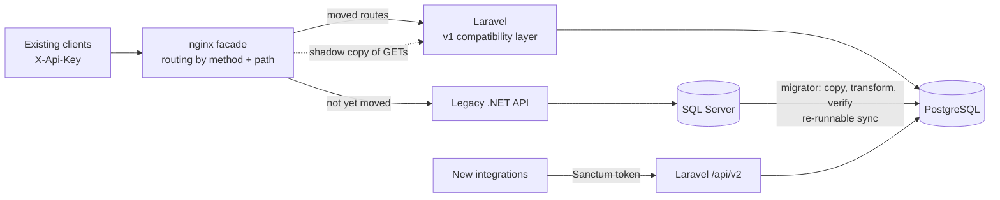

# Case study: modernizing a legacy .NET order API to Laravel + PostgreSQL

> All code and data here are a fictional re-creation built for this portfolio. No employer code, schema or data was used.
> The *approach* is what the case study is about.

## The starting point

An order-management service for a regional freight forwarder:

| | Legacy |
|---|---|
| **Runtime** | ASP.NET Web API 2 style service (.NET), ADO.NET, a static `SqlHelper` |
| **Logic** | Mostly in **stored procedures** (`usp_InsertOrderHeader`, `usp_CancelOrder`…) and large controllers |
| **Database** | SQL Server: `tblCustomer`, `CustNm`, `Curr`, `money`, `'Y'/'N'` flags, a counter table for order numbers |
| **Time** | `DATETIME` in **local Bangkok time**, no offset |
| **Clients** | ERP integrations and a customer portal that parse PascalCase JSON and `{"Message": …}` errors, with one shared `X-Api-Key` |
| **Pain** | Hard to test, Windows-only hosting, nobody wants to touch the procedures, no API versioning |

**Goal:** move to Laravel + PostgreSQL **without breaking a single existing client**, with **no big-bang weekend**, and with **a rollback at every step**.

## The approach in one picture

## Phases

Each phase is one file in [`facade/phases/`](../facade/phases). Switching is `./switch-phase.sh <name>` (an nginx reload, no downtime), and rolling back is switching to the previous file.

| Phase | Legacy serves | New system serves | Entry criteria | Rollback |
|---|---|---|---|---|
| **0 Facade only** | everything | nothing | facade adds < 5 ms; contract suite green *through* it | remove facade from DNS |
| **1 Shadow** | everything | a mirrored copy of every GET (answer discarded) | migrator verification ✅, **parity 216/216** | switch file |
| **2 Read-only slice** | everything except… | `GET /api/customers/{id}/invoices` | a week of clean shadow logs | switch file |
| **3a Freeze** (minutes) | reads; writes get `503 + Retry-After` | invoices | final `migrator` sync passes verification | switch file |
| **3b Cut-over** | nothing (kept read-only) | all of v1 + v2 | — | reverse-sync script (see Risks) + switch file |
| **4 Retire** | — | v1 compat layer stays until clients move to v2 | traffic on v1 < 1% | — |

Why **invoices first**: billing writes them in a nightly batch, so the API endpoint is read-only. If the new system shows a stale row, the next sync fixes it, and no customer action is lost.

Why **customers and orders move together**: an order references a customer. Splitting their writes across two databases would need two-way sync for a few weeks of benefit. The write freeze in 3a is a few minutes, while clients retry on `Retry-After`.

## The safety nets

1. **Contract tests** ([`contract-tests/`](../contract-tests)): 24 black-box tests, written against the **legacy** API first, as its executable specification. The *same* suite then runs against Laravel and through the facade. It checks key order, types, error bodies, status codes and the `Location` header.
2. **Parity suite**: every read endpoint (all 160 orders, 25 customers and their invoices, plus 404s) is called on both systems and compared strictly, including JSON number types. **216/216 identical.**
3. **Migrator verification** ([`migration-report.md`](migration-report.md)): after loading, it reads everything back and compares row counts, money totals, and **every row field by field**. A migration that can't prove itself didn't happen.
4. **CI runs the whole story** on every push:
   1. create legacy SQL Server;
   2. start the legacy API;
   3. migrate the Laravel schema;
   4. migrate the data;
   5. run parity;
   6. run the contract suite against legacy, against Laravel, and through the facade.

## Data migration: what had to be decided

| Legacy | New | Decision |
|---|---|---|
| `DATETIME`, local Bangkok time | `timestamptz(6)` UTC | Convert on the way in; v1 presents it back in Bangkok time. 1/300 s ticks truncated to µs. |
| `money` | `numeric(12,2)` | bcmath in PHP, so there's never float arithmetic on amounts |
| `IsActive CHAR(1)` (`Y`, `N`, and some `y`) | `boolean` | Case-insensitive, like the old API did. Reported. |
| `Status TINYINT 1–4` | `varchar` + CHECK + PHP enum | v1 still sees the numbers |
| `tblSequence` counter table | PostgreSQL `SEQUENCE` | The migrator continues numbering at the legacy value (27), so there are no duplicate order numbers |
| `PaidFlag` + `PaidDt` | `is_paid` + `paid_at` | Kept both; 2 rows "paid without date" are listed in the admin panel for finance |
| Emails with spaces / upper case | trimmed, lower-case | **The one accepted contract change**, agreed with the business and excluded in the parity check |
| Order totals ≠ sum of lines (old bug) | **kept as stored** | They were invoiced at that amount. Flagged in the report for finance. |
| `IDENTITY` ids | same ids | Existing clients' links keep working; sequences are moved past the max |

The migrator is **idempotent**: it bulk-loads (binary `COPY`) into temp tables, then `INSERT … ON CONFLICT (id) DO UPDATE`, in one transaction. The first run is the bulk load; every later run is a catch-up sync while legacy still takes writes.

## Bugs the safety nets caught (during this build)

These are the kind of issues that slip through without the checks above:

1. **A 7-hour shift on writes.** The contract suite failed on "create customer, then read it back": `CreatedDate` was 7 hours early.
   - *Cause:* Laravel writes timestamps without an offset, and this PostgreSQL server's session time zone was `Asia/Bangkok`.
   - *Fix:* pin the connection to UTC (`config/database.php`).
   - Migrated data was unaffected because the migrator writes typed values, so only new rows were wrong. That's why "read back what you wrote" tests matter.
2. **Lost milliseconds.** The migrator's verifier flagged 6 rows. Laravel's `timestampTz()` defaults to precision **0**, so PostgreSQL rounded `10:29:34.563` to `:35`. *Fix:* `timestampTz(..., 6)`, plus explicit µs truncation of SQL Server's 1/300 s ticks.
3. **`958` vs `958.0`.** Parity found 13 orders where legacy sent `958.00` (a decimal) and PHP sent `958` (an integer). A strictly typed client could treat them differently. *Fix:* `JSON_PRESERVE_ZERO_FRACTION` in the v1 layer.
4. **Sequences ignore transactions.** A Laravel test assumed the first order is `000001`. `nextval()` isn't rolled back by `RefreshDatabase`, which is good to know before relying on gap-free numbers.
5. **`#` in `.env`.** A password containing `#` was silently cut to its first 4 characters (dotenv comment syntax). Values with `#` must be quoted.

## Same API, two stacks

| | Legacy (.NET + SQL Server) | Rewrite (Laravel + PostgreSQL) |
|---|---|---|
| Endpoint + data access code | 352 lines C# + 114 lines of stored procedures | 317 lines v1 compatibility + 268 lines domain (models, services, enum) |
| Business rules | Spread over procedures and controllers | One `OrderService`, used by v1, v2 and the admin panel |
| Validation | Hand-written `if` chains per field | Form Requests (declarative rules + messages) |
| Tests | None | 35 Pest feature/unit + 24 contract + 18 migrator |
| Admin UI | None (SQL queries) | Filament panel: orders, customers, invoices, cancel action, data-quality filter |
| API versions | One, unversioned | v1 (frozen, compatible) + v2 (paginated, tokens, UTC) |
| Hosting | Windows + SQL Server licence | Any Linux container; PostgreSQL |

Laravel isn't "better than .NET". The [logistics platform](../../01-logistics-platform) in this portfolio is .NET. The reasons for Laravel in *this* case are in [ADR-0004](adr/0004-why-laravel.md).

## Risks and how they're handled

| Risk | Mitigation |
|---|---|
| A client depends on an undocumented quirk | Contract tests were written against legacy first, and shadow traffic exposes real-world calls before any switch |
| Data drift between syncs | The migrator re-runs are idempotent and verified; the final sync happens inside the write freeze |
| Rollback after 3b loses new writes | Legacy stays read-only for 2 weeks. A reverse-sync script (PostgreSQL → SQL Server, same verify step) is required before 3b in a real project; it's not implemented in this demo. |
| Mirror load on the new system | GET-only, short timeouts, answers discarded; it measured as no added latency for clients (2–25 ms vs 2 ms) |
| Long-lived v1 | v1 is isolated in `app/Http/Legacy` + `Controllers/LegacyV1`, so it's deleted as one unit later |

## Lessons

- **Write the contract tests against the old system first.** They become the specification nobody wrote down.
- **Make the migration re-runnable and self-verifying** before worrying about speed.
- **Time zones and number formats** are where "identical" systems differ. Test round-trips, not just reads.
- **Agree accepted differences explicitly** (here: email normalisation) and encode them in the parity check, so everything else stays strict.
